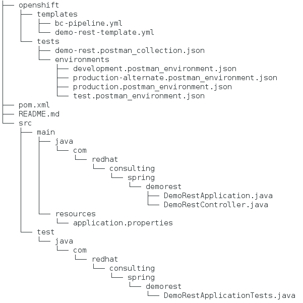

# REST demo application

## Application description

This application has been implemented to complement a CI/CD pipeline described [here](https://github.com/dsanchor/demo-cicd). It has been implemented using Spring Boot.

It will just expose a REST Api with two operations:

- GET /demo: returns a list of five different numbers in ascent order.
- POST /demo: returns the total sum of the value of the elements provided in the request

## Application structure

As shown in following image, there are two main parts clearly identified under two different folders:

- src: source code for this very simple REST Api service and related Spring Boot configuration files
- openshift: all the templates, files or configuration required to run this application on Openshift and be automatically tested by Postman+Newman



In this document, I will be focused on all the configuration files related to how to run this application on Openshift as part of the integration done with the generic pipeline mentioned before. I am not going to talk about Spring boot or any detail about the REST Api implementation. 

## Openshift & CI/CD configuration

### Templates

Two main files are used in order to:

- create the pipeline object in Openshift (BuildConfig with jenkinsPipelineStrategy): openshift/templates/bc-pipeline.yml
- create alll the necessary objects in Openshift for the application: demo-rest-template.yml

**1. [bc-pipeline.yml](https://github.com/dsanchor/demo-rest/blob/master/openshift/templates/bc-pipeline.yml)**

As mentioned before, in this BuildConfig file, I will define all the related configuration for this application to make use of the generic pipeline. See [pipeline strategy](https://docs.openshift.com/container-platform/3.6/dev_guide/builds/build_strategies.html#pipeline-strategy-options)) information from Openshift official documentation.

First, we need to configure the uri of the repository where the generic pipeline is located, the strategy (jenkinsPipelineStrategy) and the path the the Jenkinsfile. Having this pipeline defined in a centralized location will make it reusable from any application.

```
  source:
    git:
      uri: https://github.com/dsanchor/demo-cicd
  strategy:
    jenkinsPipelineStrategy:
      jenkinsfilePath: pipeline/Jenkinsfile
```

Then, we have to set all the parameters to make this generic pipeline behave as expected for our application.

```
      env:
        - name: JENKINS_PROJECT
          value: cicd
        - name: CICD_GIT_URL
          value: https://github.com/dsanchor/demo-cicd
        - name: APP_GIT_URL
          value: https://github.com/dsanchor/demo-rest
        - name: APP_TEMPLATE
          value: openshift/templates/demo-rest-template.yml
        - name: APP_NAME
          value: demo-rest
        ..........................
        ..........................

        - name: PROD_PROJECT
          value: production
        - name: PROD_TAG
          value: production
        - name: SONAR_URL
          value: http://sonarqube-cicd.apps.d-sancho.com 
        ..........................
        ..........................
```


**2. [demo-rest-template.yml](https://github.com/dsanchor/demo-rest/blob/master/openshift/templates/demo-rest-template.yml)**

We also have to describe how the application looks like in Openshift. For this purpose, I have used an [Openshift template](https://docs.openshift.com/container-platform/3.6/dev_guide/templates.html) that will be used by the pipeline to create all the objects required by Openshift in any environment (DEV, TEST, PROD and so on..).

It is important to get familiar with some Openshift concepts and objects, such as ImageStream, BuildConfig, DeploymentConfig in order to fully understand an Openshift template.


### Tests
